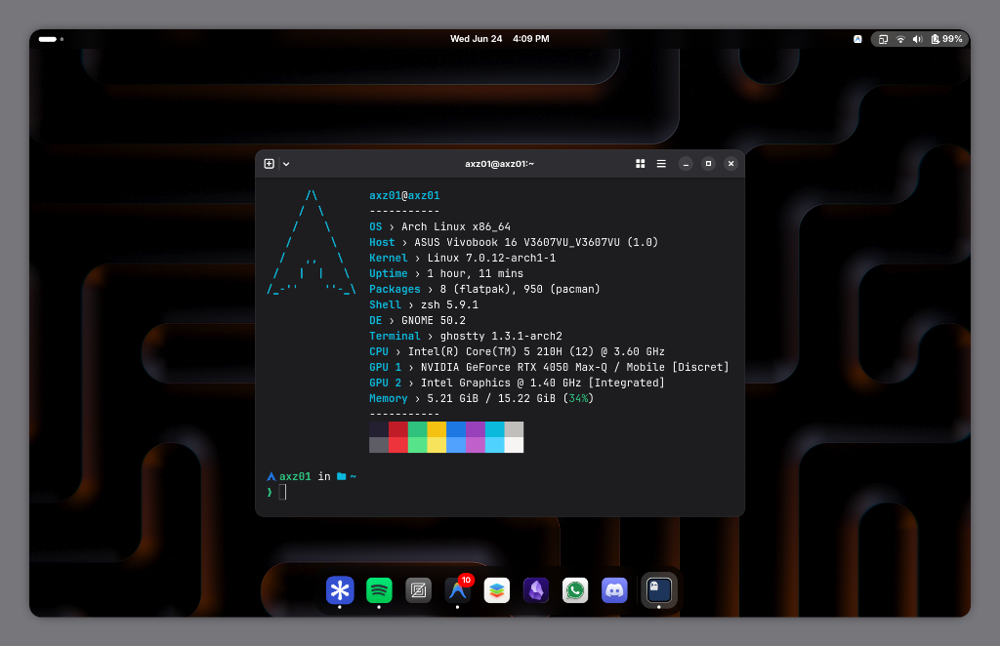

# axz01-dotfiles

My personal Linux workstation setup for **Arch Linux** and **Fedora Workstation**.

An all-in-one dotfiles repository featuring a teal/mint glassmorphic terminal, modern CLI utilities, desktop aesthetics, developer productivity tools, and media enhancements.



## Installation

```bash
git clone https://github.com/Axzo001/axz01-dotfiles.git
cd axz01-dotfiles
chmod +x install.sh
./install.sh
```

### Interactive Installer Options

When running `./install.sh`, you can choose:
* **1) Full Workstation Setup** — Complete setup with terminal, configs, Hatter icons, productivity suite, and Spotify + SpotX
* **2) Terminal Setup Only** — Zsh, OMZ, plugins, Starship, Fastfetch, Atuin, and terminal profiles
* **3) Install Hatter Icons** — Install and apply the rounded Hatter icon theme ([Mibea/Hatter](https://github.com/Mibea/Hatter))
* **4) Productivity Suite** — Install Zed, Antigravity, Android Studio, and ONLYOFFICE
* **5) Spotify & SpotX-Bash** — Install Spotify client and run SpotX-Bash for ad-blocking and UI enhancements
* **6) Deploy Configs Only** — Sync configuration files to `~/.config` and `~/.zshrc`

The installer automatically detects your distribution, builds `paru` or `yay` if missing on Arch Linux, downloads JetBrainsMono Nerd Font, and handles terminal selection (GNOME Console or Ghostty).

## What's Included

* **Shell & Prompt**: Zsh + Oh My Zsh with autosuggestions, syntax highlighting, fzf-tab, and Starship prompt.
* **Terminal**: Dark teal glassmorphic profiles for GNOME Console and Ghostty.
* **System Info**: Fastfetch with compact small logo and storage monitoring.
* **History**: Atuin with enhanced fuzzy search and command history tracking.
* **Icons & Desktop**: [Hatter Icon Theme](https://github.com/Mibea/Hatter) for rounded, modern GNOME/desktop styling.
* **Productivity Suite**:
  * **Zed Editor** — High-performance code editor
  * **Google Antigravity & CLI** — Autonomous agentic development environment
  * **Android Studio** — Android app development IDE
  * **ONLYOFFICE** — Complete local office document suite
* **Media & Entertainment**: Spotify client with [SpotX-Bash](https://github.com/SpotX-Official/SpotX-Bash) adblock and feature patcher.
* **CLI Power Tools**: `eza`, `bat`, `zoxide`, `ripgrep`, `fd`, and `fzf`.

## Quick Aliases & Helpers

* `pins`, `pupd`, `prem`, `psrc`, `pclean`, `porphan` — Distro-agnostic package management (`paru` / `dnf`)
* `gac "<msg>"` — Fast stage all and commit (`git add -A && git commit -m`)
* `mkcd <dir>` — Make directory and `cd` directly into it
* `up <n>` — Go up `n` parent directories (e.g. `up 3`)
* `preview` — Interactive fuzzy file finder with live syntax preview
* `z <dir>` — Instant smart directory jumping via Zoxide
